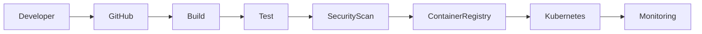

☁️ PROJECT NAME
<div align="center">

<br><br>

🚀 Enterprise Cloud Platform
Modern, scalable and secure cloud-native solution.
</div>
---
🏷️ Status
<p align="center">
  
  
  
  
  
</p>
---
✨ Overview
This repository contains a cloud platform focused on:
Scalability
High Availability
Security
Automation
Monitoring
Cost Optimization
---
🎠 Technology Showcase
> ⚠️ GitHub README does not support real carousels with JavaScript.
> The closest alternatives are animated GIFs, typing animations, SVG animations and rotating banners.
<div align="center">

</div>
---
🏗️ Architecture
```text
             Internet
                 │
        ┌────────▼────────┐
        │ Load Balancer   │
        └────────┬────────┘
                 │
        ┌────────▼────────┐
        │ Kubernetes      │
        │ Cluster         │
        └────────┬────────┘
                 │
      ┌──────────┼──────────┐
      │          │          │
 Service A  Service B  Service C
      │          │          │
      └──────────┼──────────┘
                 │
           Database Layer
```
---
🔄 CI/CD Pipeline

---
📁 Repository Structure
```bash
.
├── infrastructure/
├── kubernetes/
├── monitoring/
├── pipelines/
├── scripts/
├── docs/
└── README.md
```
---
🚀 Deployment
Terraform
```bash
terraform init
terraform plan
terraform apply
```
Kubernetes
```bash
kubectl apply -f manifests/
```
---
📊 Monitoring & Observability
Azure Monitor
Grafana
Prometheus
Log Analytics
Application Insights
Alert Manager
---
🔒 Security
Network Segmentation
RBAC
Key Vault
Secret Management
Vulnerability Scanning
Container Hardening
Policy Enforcement
---
📈 Project Metrics
<div align="center">


</div>
---
🐍 Contribution Activity
<div align="center">

</div>
---
🎬 Animated Assets Without Background
You can safely use:
SVG animations
Transparent GIFs
GitHub Contribution Snake
Readme Typing SVG
Capsule Render banners
Lottie converted to GIF/SVG
---
📚 Documentation
Architecture Design
ADRs
Disaster Recovery
Operational Runbooks
Security Guidelines
Monitoring Guides
---
🤝 Contributing
```bash
git checkout -b feature/my-feature

git commit -m "feat: new functionality"

git push origin feature/my-feature
```
---
📬 Contact
<p align="center">
<a href="https://linkedin.com">

</a>
<a href="mailto:yourmail@domain.com">

</a>
</p>
---
<div align="center">

⭐ If this project helped you, consider giving it a star.
